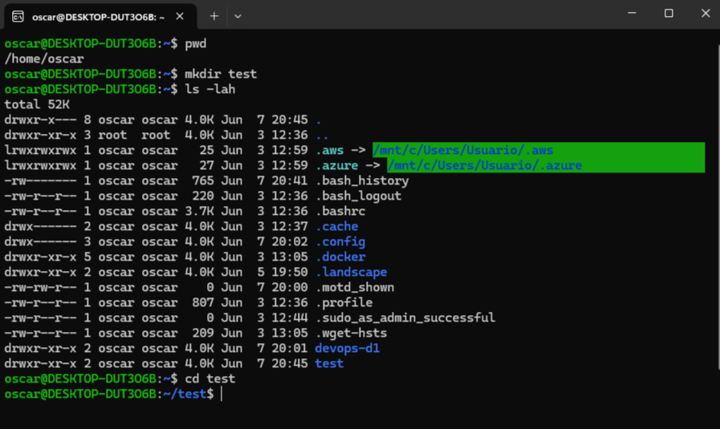
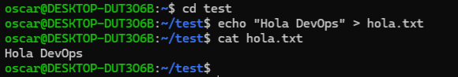
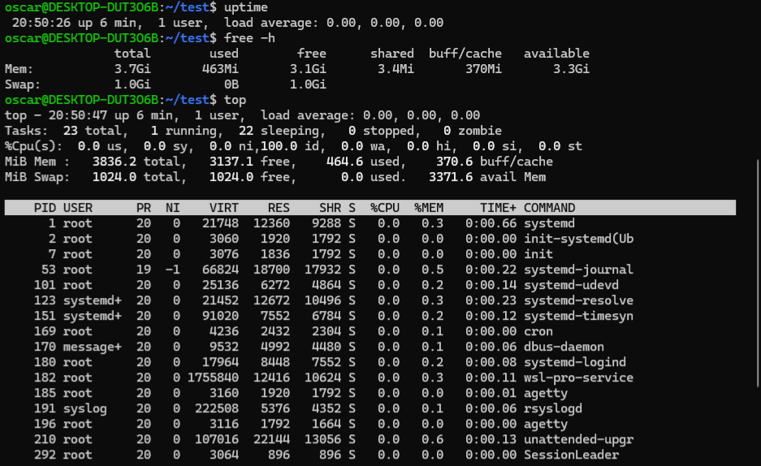

# 🧪 Comandos Practicados - Día 01

En este archivo documenté los comandos que utilicé durante el primer día del desafío **#90DaysOfDevOps**. Incluye ejemplos, salidas y capturas para acompañar el aprendizaje.

---

## 📁 Comandos de navegación

```bash
pwd       # Muestra la ruta actual
mkdir     # Crea nuevas carpetas
ls -lah   # Lista archivos y carpetas con detalles
cd        # Cambia de directorio
```



---

## 📝 Creación y lectura de archivos

```bash
echo "Hola DevOps" > hola.txt  # Crea un archivo con texto
cat hola.txt                   # Muestra el contenido del archivo
```



---

## 🔍 Comandos de diagnóstico

```bash
uptime    # Muestra el tiempo encendido del sistema
free -h   # Muestra el uso de memoria
top       # Muestra procesos activos y consumo
```



---

## 🔧 Otros comandos útiles

```bash
ps aux         # Lista todos los procesos
df -h          # Espacio en disco
du -sh *       # Tamaño de carpetas
history        # Historial de comandos usados
grep DevOps hola.txt  # Busca texto en archivo
```
